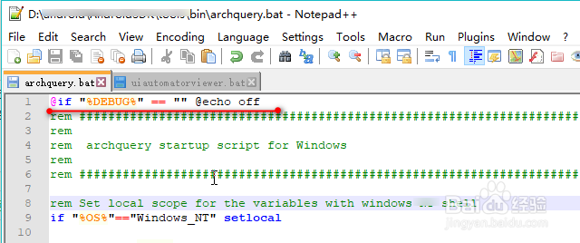

## rem、@rem和::
只对一行代码起作用
### 1.当echo处于打开状态，也就是（echo on）时
使用rem注释的语言会在BAT运行时被打印出来，而使用@rem注释的语言则不会打印出来。  
使用::注释的语言也不会打印出来。  

### 2.当echo处于关闭状态，也就是（echo off）时
rem  /  @rem   /  ::  注释的语句都不会打印出来。  

一般情况下，你可以随意使用三种注释方法。不过有时候，你也可以利用三者的不同，这时debug开关，  
使注释按照自己的意愿在需要打印时就打印出来，不需要打印时便不打印，就像下图中的代码所示（注意使用红线标记的语句）。  
